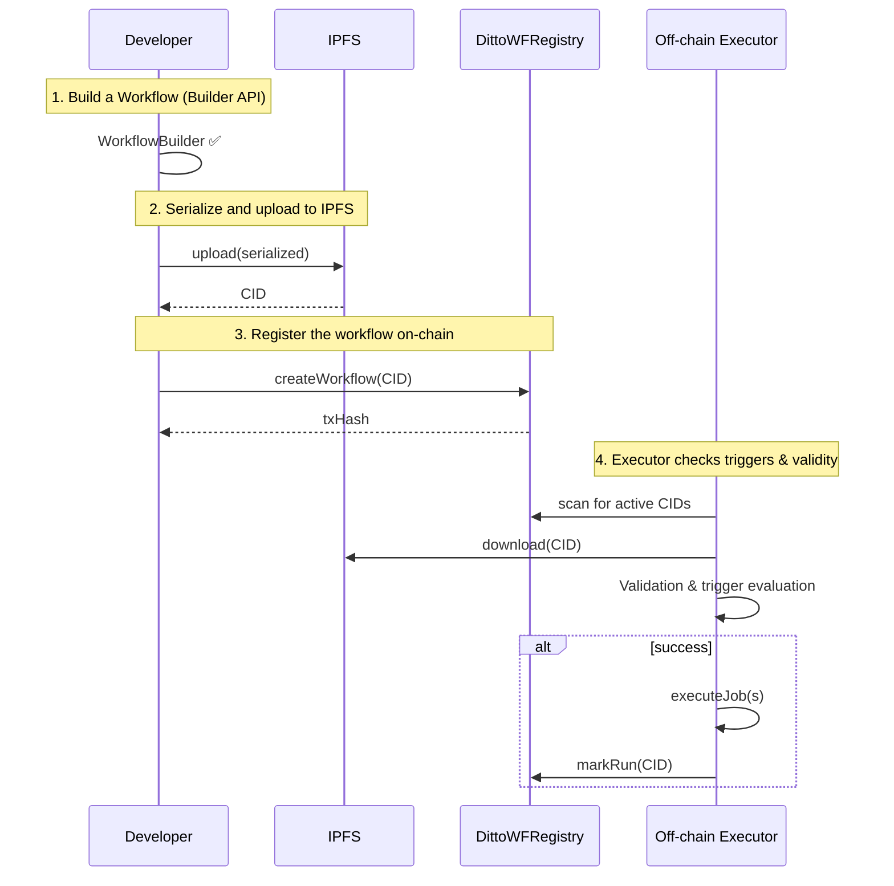

# @ditto/workflow-sdk

TypeScript SDK for declarative authoring and execution of on-chain workflows using ZeroDev Smart Sessions.

> **Goal** – allow a developer to describe a sequence of transactions as data, upload it to IPFS, register a single CID on-chain and execute the whole flow without manually signing every call.

---

## 1. Core Concepts

1. **Workflow** – the root object that groups:
   * metadata (owner, lifetime, execution limits);
   * triggers – conditions that must be satisfied before execution;
   * a collection of **Job** objects.
2. **Job** – an isolated list of steps for a single EVM chain (`chainId`). When a workflow is published a **Session Key** is automatically created for each job and used to sign all related operations.
3. **Step** – a single contract call: `target` address, ABI signature, arguments and optional `value` (ETH).
4. **Trigger** – an execution condition. Three types are supported:
   * `cron` – executed when the provided CRON expression matches the current UTC time.
   * `event` – executed after a specific event (`contractAddress`, `signature`, optional `filter`) is emitted on a given `chainId`.
   * `onchain` – executed when the value returned by a `view`/`pure` call (`target`, `abi`, `args`) satisfies the defined `onchainCondition` (e.g. `GREATER_THAN 100`).
5. **Storage** – external repository for workflow description (IPFS by default).
6. **Registry** – Ditto Workflow Registry smart-contract that stores published workflow CIDs.

---

## 2. Workflow Object Specification

```text
Workflow {
  owner:            Address,                // workflow owner
  count?:           number,                 // max number of runs (∞ if undefined)
  validAfter?:      number|Date,            // unix seconds / Date after which the workflow is valid
  validUntil?:      number|Date,            // unix seconds / Date until which the workflow is valid
  interval?:        number,                 // minimal interval between runs (seconds)
  triggers:         Trigger[],              // execution conditions
  jobs:             Job[]                   // steps grouped by chain
}

Trigger := CronTrigger | EventTrigger | OnchainTrigger

CronTrigger {
  type:   'cron',
  params: {
    schedule: string                        // standard CRON expression
  }
}

EventTrigger {
  type:   'event',
  params: {
    chainId:         number,
    contractAddress: Address,
    signature:       string,                // "Transfer(address,address,uint256)"
    filter?:         Record<string, any>    // indexed argument filters
  }
}

OnchainTrigger {
  type:   'onchain',
  params: {
    chainId:          number,
    target:           Address,
    abi:              string,               // view / pure function. If no `returns` clause is present a default `returns (bool)` is assumed
    args:             readonly any[],       // call arguments
    value?:           bigint,               // ETH value to send (optional, usually 0)
    onchainCondition?: {
      condition: OnchainConditionOperator,   // comparison operator
      value:     any                         // literal to compare with
    }
  }
}

OnchainConditionOperator :=
  EQUAL | NOT_EQUAL |
  GREATER_THAN | GREATER_THAN_OR_EQUAL |
  LESS_THAN | LESS_THAN_OR_EQUAL |
  ONE_OF

Job {
  id:       string,                         // arbitrary identifier
  chainId:  number,
  steps:    Step[],
  session?: string                          // generated automatically
}

Step {
  target: Address,
  abi:    string,                           // "transfer(address,uint256)" or "" for raw call
  args:   readonly any[],
  value?: bigint                            // ETH value in wei
}
```

Example: native token transfer step

```typescript
{
  target: '0xRecipientAddress',
  abi: '',
  args: [],
  value: 10_000_000_000_000_000n
}
```

### Trigger evaluation

All triggers attached to a workflow are evaluated by the off-chain executor before each run:

• **CronTrigger** – satisfied when the current UTC time matches the provided CRON expression.

• **EventTrigger** – satisfied when an event that matches `signature` (and `filter`, if provided) is observed on the specified `chainId`. The executor stores the block number of the last match to prevent double execution.

• **OnchainTrigger** – the executor performs a read-only call to `target.abi(args, value)`; the FIRST value returned by the function is compared with `onchainCondition.value` using `condition`.  
  • Supported Solidity return types: `bool`, any `uint*/int*`, `address`, fixed-length `bytesN` or `string`.  
  • Arithmetic comparisons (`GREATER_THAN`, `LESS_THAN`, ≥, ≤) are valid only for numeric types (`uint*/int*`).  
  • Equality operators (`EQUAL`, `NOT_EQUAL`) work for any primitive type.  
  • `ONE_OF` expects the contract value to be contained in an array supplied in `value`.  
  If the ABI string omits an explicit `returns` clause the SDK assumes the function returns a single `bool`. This allows you to specify simple boolean getters like `isActive()` without writing `isActive() view returns (bool)`.

All triggers in the `triggers` array are combined with logical **AND**. If the array is empty the workflow is considered always eligible for execution.

### Detailed trigger specification

#### CronTrigger
- **Purpose**: Satisfied when the current UTC time matches a standard CRON expression.
- **Shape**:
  - `type: 'cron'`
  - `params.schedule: string` (CRON in UTC)
- **Validation**: `schedule` must be non-empty.
- **Examples**:
  - Every minute:
    ```typescript
    WorkflowBuilder.create(owner).addCronTrigger('* * * * *')
    ```
  - Every 5 minutes:
    ```typescript
    WorkflowBuilder.create(owner).addCronTrigger('*/5 * * * *')
    ```
  - Midnight UTC daily:
    ```typescript
    WorkflowBuilder.create(owner).addCronTrigger('0 0 * * *')
    ```

#### EventTrigger
- **Purpose**: Satisfied when a matching event is observed on the specified `chainId`.
- **Shape**:
  - `type: 'event'`
  - `params.chainId: number`
  - `params.contractAddress: Address`
  - `params.signature: string` (e.g. `Transfer(address,address,uint256)`)
  - `params.filter?: Record<string, any>` (indexed arg filters)
- **Executor behavior**: Stores the last matched block number to prevent double execution.
- **Validation**: Non-empty `signature`, valid `contractAddress`, positive `chainId`.
- **Examples**:
  - Any `Transfer` on Sepolia:
    ```typescript
    .addEventTrigger({
      chainId: ChainId.SEPOLIA,
      contractAddress: '0xdeaDDeADDEaDdeaDdEAddEADDEAdDeadDEAD0000',
      signature: 'Transfer(address,address,uint256)',
    })
    ```
  - Filter by indexed `from`:
    ```typescript
    .addEventTrigger({
      chainId: ChainId.SEPOLIA,
      contractAddress: '0xTokenAddress...',
      signature: 'Transfer(address,address,uint256)',
      filter: { from: '0x1111111111111111111111111111111111111111' },
    })
    ```

#### OnchainTrigger
- **Purpose**: Performs a read-only call and compares return value with `onchainCondition.value` using `condition`.
- **Shape**:
  - `type: 'onchain'`
  - `params.chainId: number`
  - `params.target: Address`
  - `params.abi: string` (function signature; if `returns` omitted, a single `bool` is assumed)
  - `params.args: readonly any[]`
  - `params.value?: bigint` (ETH value to send; usually `0n`)
  - `params.onchainCondition?: { condition: OnchainConditionOperator; value: any }`
- **Operators** (`OnchainConditionOperator`): `EQUAL`, `NOT_EQUAL`, `GREATER_THAN`, `GREATER_THAN_OR_EQUAL`, `LESS_THAN`, `LESS_THAN_OR_EQUAL`, `ONE_OF`.
- **Return types**: Supported `bool`, numeric (`uint*/int*`), `address`, fixed-length `bytesN`, `string`. Only the first return value is used.
- **Type rules**: Arithmetic comparisons (>, ≥, <, ≤) require numeric return types; equality works for all supported primitives; `ONE_OF` expects membership in an array.
- **Validation**: Non-empty `target` and `abi`. When `onchainCondition` is present, numeric operators require numeric return types.
- **Examples**:
  - Balance greater than zero:
    ```typescript
    .addOnchainTrigger({
      chainId: ChainId.BASE_SEPOLIA,
      target: '0xfeedBEEFfeedbeEFfEEdbeEfFeEdbEEFFeed0000',
      abi: 'balanceOf(address) view returns (uint256)',
      args: [owner.address],
      onchainCondition: { condition: OnchainConditionOperator.GREATER_THAN, value: 0n },
    })
    ```
  - Boolean getter with implicit `returns (bool)`:
    ```typescript
    .addOnchainTrigger({
      chainId: ChainId.SEPOLIA,
      target: '0xPaUsEd000000000000000000000000000000000000',
      abi: 'isPaused()',
      args: [],
      onchainCondition: { condition: OnchainConditionOperator.EQUAL, value: false },
    })
    ```
  - Upper bound on totalSupply:
    ```typescript
    .addOnchainTrigger({
      chainId: ChainId.BASE_SEPOLIA,
      target: '0xdeadBEEFdeadbeEFDEAdBeeFdEadbeEFDead0001',
      abi: 'totalSupply() view returns (uint256)',
      args: [],
      onchainCondition: { condition: OnchainConditionOperator.LESS_THAN_OR_EQUAL, value: 1_000_000n },
    })
    ```
  - Symbol must be one of:
    ```typescript
    .addOnchainTrigger({
      chainId: ChainId.SEPOLIA,
      target: '0x1111111111111111111111111111111111111111',
      abi: 'symbol() view returns (string)',
      args: [],
      onchainCondition: { condition: OnchainConditionOperator.ONE_OF, value: ['USDC', 'USDT', 'DAI'] },
    })
    ```

---

---

## 3. Workflow Life-cycle



---

## 4. Quick Start

### Installation

```bash
npm install
npm run build
```

### Comprehensive example

Below is a minimal yet complete snippet that exercises every concept: three trigger types, multiple jobs on different chains and full submission / simulation:

```typescript
import {
  WorkflowBuilder,
  JobBuilder,
  ChainId,
  submitWorkflow,
  executeFromIpfs,
  IpfsStorage,
  OnchainConditionOperator,
} from '@ditto/workflow-sdk';
import { privateKeyToAccount } from 'viem/accounts';
import { baseSepolia, sepolia } from 'viem/chains';
import { IpfsServiceUrl } from '@ditto/workflow-sdk/src/utils/constants';

const owner = privateKeyToAccount(process.env.PRIVATE_KEY as `0x${string}`);
const executorAddress = process.env.EXECUTOR_ADDRESS as `0x${string}`;
const storage = new IpfsStorage(IpfsServiceUrl);

const workflow = WorkflowBuilder.create(owner)
  // triggers
  .addCronTrigger('*/5 * * * *')
  .addEventTrigger({
    signature: 'Transfer(address,address,uint256)',
    contractAddress: '0xdeaDDeADDEaDdeaDdEAddEADDEAdDeadDEAD0000',
    chainId: ChainId.SEPOLIA,
  })
  .addOnchainTrigger({
    chainId: ChainId.BASE_SEPOLIA,
    target: '0xfeedBEEFfeedbeEFfEEdbeEfFeEdbEEFFeed0000',
    abi: 'balanceOf(address) view returns (uint256)',
    args: [owner.address],
    onchainCondition: {
      condition: OnchainConditionOperator.GREATER_THAN,
      value: 0n,
    },
  })
  .addOnchainTrigger({
    chainId: ChainId.SEPOLIA,
    target: '0xPaUsEd000000000000000000000000000000000000',
    abi: 'isPaused()', // returns (bool) assumed
    args: [],
    onchainCondition: {
      condition: OnchainConditionOperator.EQUAL,
      value: false,
    },
  })
  .addOnchainTrigger({
    chainId: ChainId.BASE_SEPOLIA,
    target: '0xdeadBEEFdeadbeEFDEAdBeeFdEadbeEFDead0001',
    abi: 'totalSupply() view returns (uint256)',
    args: [],
    onchainCondition: {
      condition: OnchainConditionOperator.LESS_THAN_OR_EQUAL,
      value: 1_000_000n,
    },
  })
  .addOnchainTrigger({
    chainId: ChainId.SEPOLIA,
    target: '0x1111111111111111111111111111111111111111',
    abi: 'symbol() view returns (string)',
    args: [],
    onchainCondition: {
      condition: OnchainConditionOperator.ONE_OF,
      value: ['USDC', 'USDT', 'DAI'],
    },
  })
  // limits
  .setCount(3)
  .setInterval(300)
  .setValidUntil(Date.now() + 24 * 60 * 60 * 1000)
  // job on Sepolia
  .addJob(
    JobBuilder.create('erc20-airdrop')
      .setChainId(sepolia.id)
      .addStep({
        target: '0xEeeeeEeeeEeEeeEeEeEeeEEEeeeeEeeeeeeeEEeE',
        abi: 'transfer(address,uint256)',
        args: [executorAddress, 1_000_000n],
      })
      // native token transfer step
      .addStep({
        target: executorAddress,
        abi: '',
        args: [],
        value: 10_000_000_000_000_000n,
     
      })
      .build(),
  )
  // job on Base Sepolia
  .addJob(
    JobBuilder.create('greet')
      .setChainId(baseSepolia.id)
      .addStep({
        target: '0x1234123412341234123412341234123412341234',
        abi: 'setGreeting(string)',
        args: ['Hello, Ditto!'],
      })
      .build(),
  )
  .build();

const { ipfsHash } = await submitWorkflow(workflow, executorAddress, storage, owner);

await executeFromIpfs(ipfsHash, storage, executor, 0n, /*simulate=*/ true);
```

This example demonstrates:

* `CronTrigger`, `EventTrigger`, `OnchainTrigger` working together.
* Two `Job` objects targeting different EVM chains.
* Submission to IPFS + registry and dry-run execution (simulate=true).

## 5. Validation

`WorkflowValidator` checks:
* ABI signatures, argument count and address formats;
* presence and authority of Session Keys;
* time windows (`validAfter`, `validUntil`);
* JSON schema compliance (powered by `zod`).

---

## 6. Features & Limitations

* Only EVM chains listed in `src/utils/chainConfigProvider.ts` are supported.
* `Step.abi === ""` enables raw call without ABI encoding (e.g. for proxy contracts).
* A single workflow may include jobs for multiple chains; they are executed in parallel.
* To use a paymaster set `usePaymaster: true` in `execute` / `executeFromIpfs`.

---

## 7. Environment Variables

```env
ZERODEV_API_KEY=<api-key>
IPFS_SERVICE_URL=https://ipfs-service.dittonetwork.io
```

